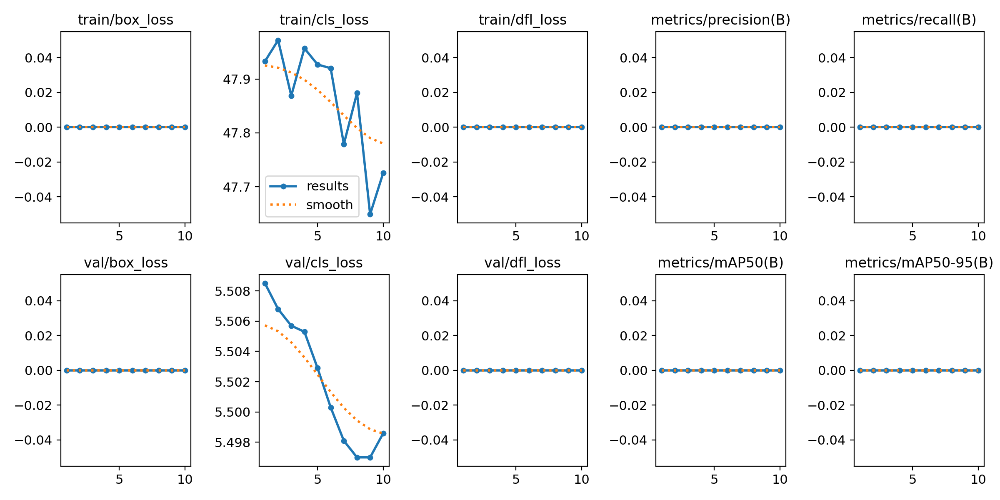
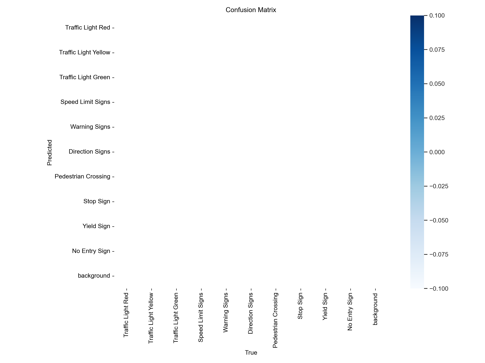
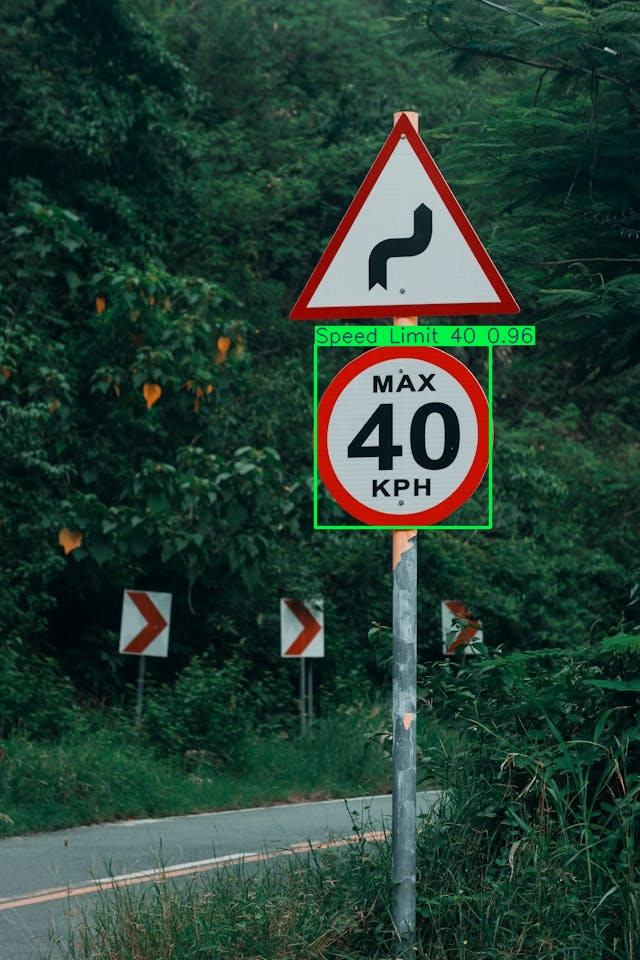
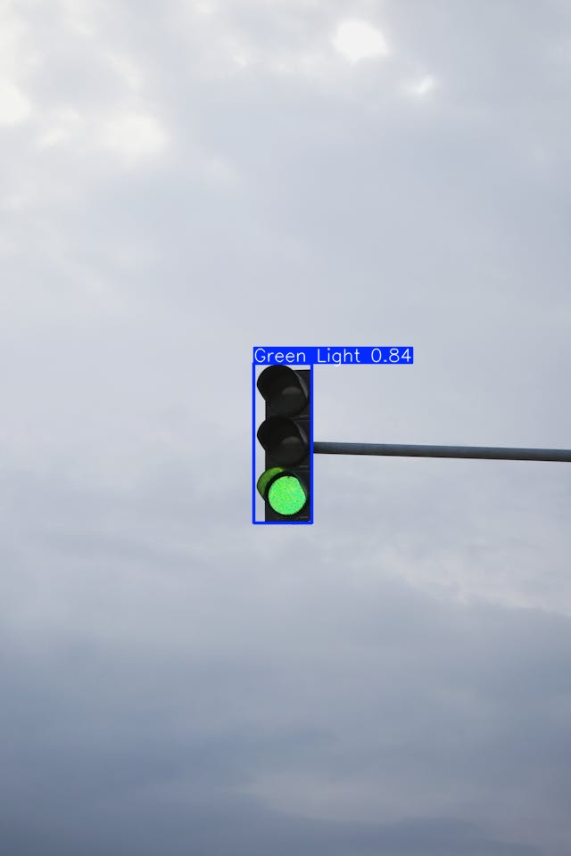

# Road Quality Monotoring system


A comprehensive deep learning pipeline for real-time traffic sign detection, custom logging, and statistics analysis using the latest **YOLOv11** architecture. This project fine-tunes YOLOv11 on a self-driving cars dataset to detect 15 distinct types of traffic signs, performs overlapping bounding box suppression (NMS), crops detection regions, and records extensive metadata (timestamps, coordinates, confidence, lighting conditions) into a CSV database.

---

## 🚀 Key Features

*   **State-of-the-Art Detection:** Fine-tuned YOLOv11 model optimized for detecting 15 unique traffic signs and signals.
*   **Custom Logging Pipeline:** Real-time CSV logging via `csv_logger.py` tracking bounding box dimensions, center points, model info, timestamps, and lighting conditions.
*   **Automatic Image Cropping:** Crops and exports each validated detection to `detections/crops/` for review.
*   **Smart Overlap Filtering:** Built-in Non-Maximum Suppression (NMS) to eliminate duplicate/overlapping detections.
*   **Performance Metrics Visualizer:** Validation script `analyze_results.py` to analyze logging data and plot statistics.
*   **Comprehensive CLI Tools:** Scripts for batch image processing, video inference, dataset setup, and pipeline training.

---

## 🛠️ Technologies Used

*   **Deep Learning Framework:** `ultralytics` (YOLOv11)
*   **Computer Vision:** `OpenCV` (Python)
*   **Data Processing:** `numpy`, `csv`, `pandas`
*   **Visualization:** `matplotlib`, `seaborn`
*   **Development Platform:** Python 3.x, Windows Command Line / Shell

---

## 📁 Project Structure

```
Road-Quality-Monitoring-System-AI 
├── assets/                  # Documentation images, confusion matrix, and training plots
├── data/
│   └── input/               # Test inputs (images and test videos)
├── dataset/                 # Dataset folder (images/labels subset for validation/testing)
│   ├── test/
│   ├── train/
│   └── valid/
│   └── data.yaml            # YOLO dataset configuration
├── detections/              # Auto-created output directory for logs and crops
│   └── crops/               # Cropped images of detected traffic signs
├── model/
│   └── traffic_sign_detector.pt  # Fine-tuned YOLOv11 custom weights (5.4MB)
├── Test/                    # Additional test images
├── .gitignore               # Tailored git exclusions list
├── requirements.txt         # Pip dependency list
├── csv_logger.py            # Robust logger class handling validation, crops, and NMS
├── analyze_results.py       # Helper script to parse logs and graph statistics
├── detect_video.py          # Script for standalone video inference
├── process_image.py         # Batch/single image detection and CSV logging
├── process_video.py         # Video stream detection, frame-by-frame validation, and logging
├── setup_dataset.py         # Script to structure or check the local dataset setup
├── train_and_test.py        # Comprehensive training and validation pipeline
├── train_simple.py          # Minimal training execution script
└── README.md                # Project documentation and performance report
```

---

## 📊 Fine-Tuning and Evaluation

The model was fine-tuned on the **Self-Driving Cars Dataset** (containing **4,969** images split into **3,530** train, **801** validation, and **638** test images).

### YOLO11n Summary (Fused)
*   **Layers:** 238
*   **Parameters:** 2,585,077
*   **GFLOPs:** 6.3

### Validation Metrics

| Class | Images | Instances | Box (Precision) | Recall | mAP50 | mAP50-95 |
| :--- | :---: | :---: | :---: | :---: | :---: | :---: |
| **All Classes** | 801 | 944 | **0.950** | **0.905** | **0.959** | **0.836** |
| Green Light | 87 | 122 | 0.901 | 0.743 | 0.851 | 0.525 |
| Red Light | 74 | 108 | 0.891 | 0.722 | 0.844 | 0.529 |
| Speed Limit 100 | 52 | 52 | 0.950 | 0.942 | 0.989 | 0.889 |
| Speed Limit 110 | 17 | 17 | 0.916 | 1.000 | 0.986 | 0.915 |
| Speed Limit 120 | 60 | 60 | 1.000 | 0.943 | 0.995 | 0.908 |
| Speed Limit 20 | 56 | 56 | 0.981 | 0.930 | 0.985 | 0.871 |
| Speed Limit 30 | 71 | 74 | 0.963 | 0.959 | 0.984 | 0.924 |
| Speed Limit 40 | 53 | 55 | 0.935 | 0.945 | 0.988 | 0.887 |
| Speed Limit 50 | 68 | 71 | 0.973 | 0.915 | 0.980 | 0.886 |
| Speed Limit 60 | 76 | 76 | 0.920 | 0.912 | 0.960 | 0.890 |
| Speed Limit 70 | 78 | 78 | 0.987 | 0.962 | 0.981 | 0.900 |
| Speed Limit 80 | 56 | 56 | 0.960 | 0.929 | 0.973 | 0.866 |
| Speed Limit 90 | 38 | 38 | 0.954 | 0.789 | 0.924 | 0.784 |
| Stop | 81 | 81 | 0.975 | 0.982 | 0.988 | 0.929 |

### Training Progress Metrics
The progress charts show rapid validation mAP convergence and steady decline in both bounding box and classification losses:



### Confusion Matrix
The confusion matrix indicates clean boundaries and high accuracy with minimal misclassifications across class boundaries:



---

## 👁️ Visual Detections Sample

Below are detection samples showcasing the model's performance on various traffic signs:

<div style="display: flex; flex-wrap: wrap; justify-content: center; gap: 10px;">
    
    
    
    
    
    
</div>

---

## 💻 Usage Instructions

### 1. Process Images
Perform detection on a default sample image or batch-process all images in the inputs folder.
*   **Process Default Image (`data/input/stop_sign.jpg`):**
    ```bash
    python process_image.py
    ```
*   **Process All Images in Input Folder (without GUI window):**
    ```bash
    python process_image.py --all --nogui
    ```

### 2. Process Videos
Run YOLOv11 inference on local video files to detect, validation-filter, crop, and log frames:
```bash
python process_video.py
```

### 3. Log Output Format
Logging outputs are written to `detections.csv`. Sample row metadata includes:
*   `Detection_ID`, `Timestamp`, `Frame_Number`, `Video_Source`
*   `Traffic_Sign_Name`, `Confidence_Score`
*   `BoundingBox_X_Min`, `BoundingBox_Y_Min`, `BoundingBox_Width`, `BoundingBox_Height`, `BoundingBox_Area`
*   `Crop_Image_Path` (links directly to cropped JPEG)

---

## 🔮 Future Enhancements

*   **Multi-Model Ensembles:** Incorporate a second-stage classifier for finer sub-class categorization (e.g. damaged signs vs. clean signs).
*   **Distance Estimation:** Leverage bounding box sizes to project distance estimates to signs.
*   **GPS Integration:** Mock location/GPS simulation coordinates to draw signs on maps.
*   **Embedded Deployment:** Export custom model weights to ONNX or OpenVINO format for low-latency inference on Edge devices.

---

## ✍️ Author Information

Developed with 💖 by [Rajesh Kumar Sahoo](https://github.com/RajeshKumarSahoo-2006).

*   **GitHub:** [@RajeshKumarSahoo-2006](https://github.com/RajeshKumarSahoo-2006)
*   **Project Link:** [Road-Quality-Monitoring-System-AI ⭐](https://github.com/RajeshKumarSahoo-2006/traffic-sign-detection-using-yolov11)
   
